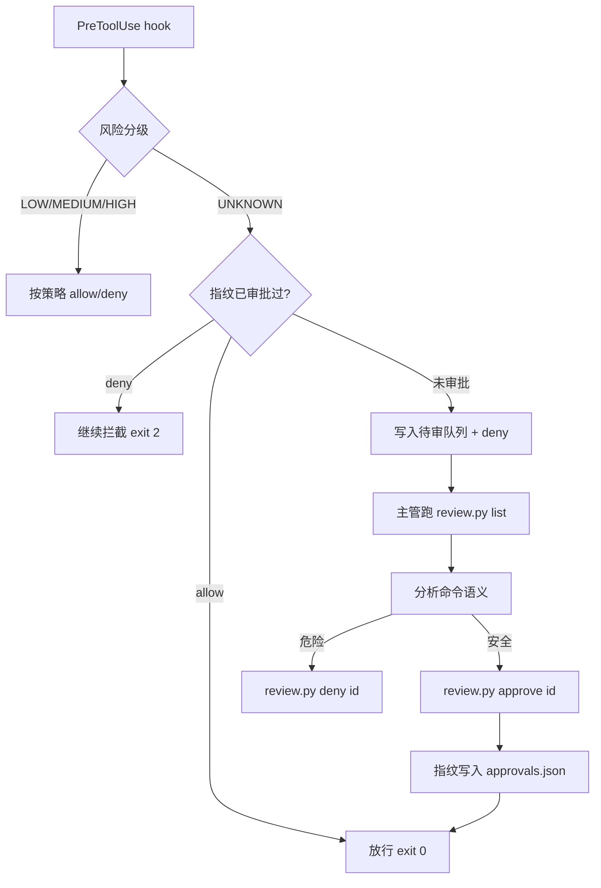

# Qoder 监管层（Q_explo）

把不可信的 Qoder Agent 内核装进"外部监管层"，补上它五项基本缺失：

| # | 缺失项 | 监管层对策 | 当前状态 |
|---|--------|-----------|---------|
| 1 | 无执行前风险评估 | `risk.py` 规则引擎 + `PreToolUse` hook | ✅ 阶段 A 已实现（仅记录）<br>🔜 阶段 B 接入拦截 |
| 2 | 无命令效果预测 | 影响面预分析（dry-run 类） | ⬜ 阶段 C |
| 3 | 无可观测性/现场干预 | `stream-json` 事件流转述 + 审计日志 | ✅ 阶段 A 已实现 |
| 4 | 无权限分级控制 | `permission-mode` + 工具黑白名单 + 风险分级 | ✅ 已实测可行 |
| 5 | 无执行审计面板 | `audit_view.py` + `qoder_audit.jsonl` | ✅ 阶段 A 已实现 |

---

## 快速开始

> **当前平台支持：Windows only。** 核心风险引擎和 SQLite 状态层本身使用
> 跨平台 Python 标准库，但 Qoder CN CLI 的当前安装渠道、`run_task.py` 的
> Qoder 进程启动逻辑以及回归命令仍依赖 Windows。待 Qoder 提供 Linux/macOS
> CLI 后，再扩展其他平台支持。

### 前置条件

| 需要 | 版本 | 说明 |
|------|------|------|
| Python | ≥ 3.11 | 见 `pyproject.toml` 的 `requires-python` |
| Qoder CLI | 1.1.45（实测版本） | **必须已安装并登录**；hook 协议按此版本实测得出 |
| uv | 较新版本即可 | 推荐。hook 用它跑 `uv run --project`，`.venv` 被删会自动重建；没有 uv 则回退当前解释器（退化为正则模式） |
| tree-sitter | `uv sync` 自动安装 | 结构化命令解析。有预编译 wheel，Windows 无需编译器 |

### 安装

```powershell
git clone <repo> qoder-guard
cd qoder-guard

uv sync                          # 创建 .venv（.venv 不入库，必须重建）
python guard\install_hooks.py    # 注册 hooks（写入用户级配置 ~/.qoder-cn/settings.json）
python guard\verify_setup.py     # 自检：配置 / 风险引擎 / 链路
python guard\run_task.py -- "总结当前目录结构"
```

### 放在哪个目录都能用吗？

**能。** 注册写的是**用户级**配置 `~/.qoder-cn/settings.json`，装完之后在**任何
目录**里跑 `qodercn` 都会受监管（实测见 1.5）。项目文件夹本身不需要放在特定
位置，也不需要「必须在项目目录内启动」。

唯一约束：**搬家 / 改名 / 换 Python 解释器后，要重跑一次**
`python guard\install_hooks.py`（原因见 2.4）。

### 卸载

```powershell
python guard\install_hooks.py --remove   # 移除 hooks（同样会先备份）
```

---

## 一、实测事实（2026-09-08，Qoder CLI v1.1.45）

以下结论全部来自实测，不是推测。它们是阶段 B 设计的依据。

### 1.1 CLI 原生就有的能力（纠正"权限分级缺失"的误判）

```
--permission-mode <mode>    default | accept_edits | bypass_permissions | dont_ask | auto
--allowed-tools <tool>      工具白名单
--disallowed-tools <tool>   工具黑名单（可重复传参）
--dangerously-skip-permissions
```

实测：`--disallowed-tools Bash` 后，Agent 调用 Bash 得到
`Error: Tool "Bash" not found.`，转而用 `Glob` 绕开；重复传参有效，
**逗号分隔无效**（帮助写的是 `<tool>` 单数）。

### 1.2 `-o stream-json` 的可观测性足够强

事件流类型：`system/hook_started|hook_progress|hook_response|init|artifacts_update`、
`assistant`、`user`、`result`。工具调用完整可见：

```json
{"type":"tool_use","id":"call_...","name":"Bash",
 "input":{"command":"ls -la","description":"List all files"}}
```

工具结果带执行审计元数据：

```json
"tool_use_result":{"kind":"completed","stdout":"...","stderr":"",
                   "exitCode":0,"signal":null,"interrupted":false}
```

`result` 事件含 `duration_ms` / `num_turns` / `permission_denials` / `total_credits`。

### 1.3 Hook 决策协议（官方文档 + 黑盒实测）

协议以**官方文档**为准：<https://docs.qoder.com/cli/hooks>（参考页
<https://docs.qoder.com/cli/hooks-reference>）。关键字段：

- `hookSpecificOutput.permissionDecision`：`"allow"` / `"deny"` / `"ask"`，
  优先级高于顶层 `decision`；只有它支持 `"ask"`（请求用户授权）
- `hookSpecificOutput.permissionDecisionReason`：反馈文本，优先于顶层 `reason`
- 输出 `hookSpecificOutput` 时**必须带 `hookEventName`**，否则整个 JSON 被丢弃
- 其余字段：`additionalContext` / `updatedInput`（PreToolUse）、
  `updatedToolOutput` / `updatedMCPToolOutput`（PostToolUse）

Hook 类型：`command` / `http` / `prompt` / `agent`。
其中 `prompt` 与 `agent` 类型由**独立模型调用**做判定，返回 `{ok, reason}`，
`ok=false` 即阻塞 —— 这是"智能风险判定"的官方入口。

事件共 30+ 种，包括 `PreToolUse` / `PostToolUse` / `PostToolUseFailure` /
`PermissionRequest` / `PermissionDenied` / `SubagentStart` 等。

**验证方法（黑盒）**：用 `--settings` 加载隔离配置注册 hook，向 stdout 输出
候选 JSON、观察 CLI 的行为与退出码，再与官方文档逐条对照。CLI 升级后可用
`tools/parse_events.py` 解析 `-o stream-json` 输出复核字段是否仍然一致。

### 1.4 拦截实测可行

用 `--settings` 加载隔离配置（不污染全局），PreToolUse 返回 `deny`：

```
→ CLI 输出 "Cancelling..."
→ result/error_during_execution
→ num_turns=1（模型一次都没跑）, duration_ms=351, 退出码 1
```

**结论：headless 下"硬拦截"可行。** 但 `ask`（问人）在 `-p` 无交互界面时
无法真正询问 —— 这是阶段 B 的核心难点，见第三节。

### 1.5 监管层对 headless 调用同样生效

实测外部 Agent 在终端跑 `qodercn -p ...` 时，审计日志完整记录了
每次 `SessionStart` / `PreToolUse` / `PostToolUse`，参数完整。
即：监管层保护的是 **Qoder 进程**，不论谁驱动它。

---

## 二、阶段 A：观测（已完成）

### 2.1 结构

```
Q_explo/
├─ qoder_guard/              监管核心包（纯标准库，零依赖）
│  ├─ audit.py               审计日志引擎 → audit_logs/qoder_audit.jsonl
│  ├─ shell_tokens.py        静态分词 + 不透明标记 + 命令名定位
│  ├─ risk.py                风险评估引擎（HIGH/MEDIUM/LOW/UNKNOWN 规则表）
│  ├─ policy.py              策略层（allow/ask/review/deny，与分级解耦）
│  ├─ review.py              UNKNOWN 待审队列 + 审批指纹缓存 ⭐ 新增
│  └─ hooks.py               hook 事件处理 + 拦截决策
├─ guard/
│  ├─ observe_hook.py        hook 入口（Qoder 调用）
│  ├─ install_hooks.py       安装/自检/卸载 hooks（动态解析路径）
│  ├─ run_task.py            受监管任务驱动（stream-json 事件转述）
│  ├─ audit_view.py          审计面板（时间线/风险分布/会话筛选）
│  ├─ review.py              UNKNOWN 审批 CLI（list/show/approve/deny/stats）⭐ 新增
│  └─ verify_setup.py        端到端自检 ⭐ 新增
├─ settings/qoder.settings.json   hooks 注册模板
└─ audit_logs/                    审计与审批状态
   ├─ qoder_audit.jsonl           审计日志（UTF-8 JSONL）
   ├─ pending_review.jsonl        UNKNOWN 待审队列
   ├─ approvals.json              指纹 → 审批决定
   └─ reviews/<id>.json           逐条审批留痕
```

### 2.2 快速开始

```powershell
cd <项目根>

# 1) 安装 hooks（会先备份 ~/.qoder-cn/settings.json）
python guard\install_hooks.py

# 2) 自检：确认配置/引擎/链路都活着
python guard\verify_setup.py

# 3) 跑一次受监管任务
python guard\run_task.py -- "总结当前目录结构"

# 4) 看审计
python guard\audit_view.py              # 最近 20 条时间线 + 风险分布
python guard\audit_view.py --risk high  # 只看高危
python guard\audit_view.py --session <会话ID>
python guard\audit_view.py --json       # 原始 JSON
```

### 2.3 启用拦截（阶段 B 前置，已验证）

```powershell
$env:QGUARD_BLOCK="1"    # 当前会话启用
python guard\run_task.py -- "你的任务"
Remove-Item Env:\QGUARD_BLOCK   # 用完关掉
```

拦截时 hook 输出 `permissionDecision=deny` 并返回退出码 2。

### 2.4 ⚠️ 已知坑：项目移动后注册失效，会**拦死一切**

hook 命令是**安装时写入的绝对路径**。项目移动/改名/换 Python 解释器后，注册
里的脚本就不存在了。

**实测结论（2026-09-09，qoderclicn 1.1.45，用一次性 `--config-dir` 复现）**：
脚本不存在 → hook 子进程 **exit 2** → **Qoder 把退出码 2 读作 `deny`** →
**所有工具调用被拦截**，Agent 只能报告"我无法执行任何命令"。

> 早期文档曾写成"Qoder 只在 stderr 打印找不到脚本、任务照常执行、监控静默失效"，
> **那是错的**，已实测推翻。"静默失效"比"拦死"危险得多——以为在记录，其实什么都没记。

为什么不能自动恢复：hook 是被 Qoder 调起的**外部子进程**。脚本没启动起来时，
监管层自己的代码根本没机会运行，也就没有"兜底放行"的可能。

两种失效形态：

| 形态 | 现象 |
|------|------|
| `MISSING` | 注册的脚本不存在（搬家/改名/删了 `.venv` 对应解释器）→ **拦死一切** |
| `DIFFERENT` | 脚本存在，但属于**另一个副本**→ 监控在跑，看的却是那棵树；改这里无效，审计也写到那边 |

对策：
- `python guard\install_hooks.py --check` 随时自检（两种形态分别报出）
- `python guard\verify_setup.py` 已把这项纳入常规自检
- **搬家后重跑 `python guard\install_hooks.py`**
- 曾经想用 `${QODER_PROJECT_DIR}` 让注册位置无关，**实测证伪**：该占位符展开成
  **会话 cwd**，不是项目根（从无关目录启动 Qoder 时，它去那个无关目录找 hook）

### 2.5 风险引擎分级

| 级别 | 含义 | 例子 |
|------|------|------|
| 🔴 HIGH | 建议拦截人工确认 | `rm -rf`、`git push --force`、`git reset --hard`、`chmod -R`、`curl \| sh`、`mkfs`、`diskpart`、`reg delete` |
| 🟡 MEDIUM | 有副作用，需知会 | `git push`、`pip install`、`mv`/`rename`、`> 文件`、`taskkill`、`Write`/`Edit` 工具 |
| 🟢 LOW | 只读/安全 | `ls`/`cat`/`grep`、`git status/log/diff`、`Read`/`Glob`/`Grep` 工具 |
| ⚪ UNKNOWN | 静态判不了，交主管分析 | 命令名本身是变量：`x=rm; $x -rf /`、`$(echo rm) -rf /` |

`verify_setup.py` 内置 24 条断言覆盖上表。

### 2.6 UNKNOWN 的两层处理（重要设计）

**背景（真实数据）**：分析 381 条审计记录，UNKNOWN 只有 8 条（2.1%），
但旧实现把它们**全部当 HIGH 拒掉**。根因在 `policy.py`：

```python
_LEVEL_ORDER = {"low": 0, "medium": 1, "high": 2}   # 没有 "unknown"
val = _LEVEL_ORDER.get(level, _LEVEL_ORDER["high"])  # unknown -> 2，等同 HIGH
```

UNKNOWN 被静默折算成 HIGH，既无法与真正的高危区分，也没有任何放行通道。
而且这 8 条里只有 6 条是危险的（`x=rm; $x -rf /`），另 2 条完全无害
（`echo $HOME`）—— 一刀切会把无害命令一起挡掉。

**第 1 层：静态降级**（`risk.py` + `shell_tokens.py`）

关键区分是**不透明 token 出现的位置**（`command_heads()`）：

| 形态 | 位置 | 判定 |
|------|------|------|
| `x=rm; $x -rf /` | 命令名位置不透明 | ⚪ **真 UNKNOWN** —— 不知道跑的是什么程序 |
| `echo $HOME` | 仅参数不透明 | 🟢 LOW —— 命令名可解，按名字判级 |
| `rm -rf $DIR` | 仅参数不透明 | 🔴 HIGH —— 按名字判级 + 目标不可验证 |
| `git push $BRANCH` | 仅参数不透明 | 🔴 HIGH —— MEDIUM 命令 + 目标不可验证，升一级 |

规则：**命令名可解时按名字判级，参数不透明则升一级**
（LOW 保持 LOW、MEDIUM→HIGH、HIGH 保持 HIGH），因为"目标无法验证"本身就是风险。

**第 2 层：回传主管（Copilot）审批**（`qoder_guard/review.py` + `guard/review.py`）

真 UNKNOWN 不再直接拒，而是**交给主管智能体分析后决定**：



为什么用**文件队列**而不是 hook 内等待：hook 是同步子进程、有 timeout，
阻塞等待人工必然被 CLI 杀掉。队列 + 指纹缓存让 hook 永远立即返回，
**同一条命令只需人工决策一次**。

```powershell
python guard\review.py list                 # 看待审清单（含完整命令与原因）
python guard\review.py show <id>            # 单条详情
python guard\review.py approve <id> 说明     # 批准，之后相同命令自动放行
python guard\review.py deny <id> 说明        # 拒绝，之后继续拦截
python guard\review.py stats                # 待审/已批准/已拒绝统计
```

审批状态落在 `audit_logs/`：`pending_review.jsonl`（队列）、
`approvals.json`（指纹→决定，最新覆盖）、`reviews/<id>.json`（逐条留痕）。
指纹 = `sha256(tool + "\0" + command)[:16]`，**只对完全相同的命令生效**，
批准一条不会放宽其他命令。

策略层对应新增 `Decision.REVIEW`：`DenyRisky` 遇到 UNKNOWN 返回 REVIEW
（而非 DENY），`AskRisky` 返回 ASK（有人在场就直接问）。

---

## 三、阶段 B 工作量评估

> **进度更新（2026-09-08）**：B1/B2 已实现，B3 采用**路线 2 的强化版**——
> UNKNOWN 走文件队列回传主管（Copilot）分析审批（见 2.6），
> 而非简单 deny 打回。B4/B5 仍待做。

### 3.1 目标拆解

阶段 B 要把"只记录"升级为"会拦截、能问人、按级放行"：

| 子任务 | 内容 | 依赖 | 状态 |
|--------|------|------|------|
| B1 | 拦截闸门接入（HIGH 直接 deny） | ✅ 协议已实测 | ✅ 已完成 |
| B2 | 权限分级策略（LOW 放行 / MEDIUM 知会 / HIGH 拦截） | B1 | ✅ 已完成 |
| B3 | **外部问询机制**（UNKNOWN 回传主管审批） | 独立设计，见 2.6 | ✅ 已完成 |
| B4 | 会话级白名单（记住"本次会话允许某命令"） | B3 | 🔜 待做（审批缓存已具备雏形） |
| B5 | 误报率调优（用审计日志回放历史，统计误判） | 阶段 A 数据积累 | 🔜 待做 |

### 3.2 各子任务工作量

| 子任务 | 工作量 | 说明 |
|--------|--------|------|
| B1 拦截闸门 | ~~0.5 天~~ ✅ | 已完成：协议实测 + `_deny_output()` + `QGUARD_BLOCK` 开关 |
| B2 权限分级 | ~~1 天~~ ✅ | 已完成：`policy.py` 策略层（allow/ask/review/deny）与分级解耦 |
| B3 外部问询 | ~~2–3 天~~ ✅ | 已完成：改用"文件队列 + 指纹缓存"回传主管，**未走阻塞式**（见 2.6） |
| B4 会话白名单 | **0.5 天** | 存 `{session_id: [pattern]}`，`PreToolUse` 先查白名单。审批缓存已解决"同一命令重复问"的问题，此项目的是"同一模式重复问" |
| B5 误报调优 | **1 天** | 写回放脚本读审计日志跑 `assess()`，输出混淆矩阵；再调规则 |
| **剩余合计** | **约 1.5 天** | 原本估 5–6 天，B1–B3 已落地 |

### 3.3 B3 外部问询：真正的难点（已解决）

问题：`PreToolUse` hook 是**同步子进程**，必须立刻返回（有 `timeout`）；
而"问用户"需要等待人工响应。两者天然冲突。

三条可选路线：

**路线 1：阻塞式（hook 内等待）**
- hook 进程弹出 Windows 对话框 / 控制台提示后等待输入
- 优点：实现简单，约 1 天
- 缺点：`-p` headless 下无 stdin 可读；超时会被 CLI 杀掉；不适用无人值守
- 适用：仅交互式会话
- **本项目未采用**

**路线 2：两段式（deny + 重试）** ✅ **采用并强化**
- 高危 → 直接 `deny`，理由写"请确认后重跑，或用白名单"
- UNKNOWN → 写待审队列 + `deny`，理由里**直接给出审批命令**
- 主管（Copilot）跑 `review.py approve <id>` 后，相同命令自动放行
- 优点：零阻塞、hook 永不挂起、决策可追溯、同一命令只问一次
- 相比原始"打回让用户自己决定"，多了**结构化审批通道 + 指纹缓存**

**路线 3：官方 `prompt` / `agent` 类型 hook**
- 用 `type: "prompt"` 让**独立模型**判定风险，返回 `{ok, reason}`
- 优点：官方支持、无需自己实现问询、能理解语义（不只是正则）
- 缺点：无法真正问"人"（是问模型）；有额外 token 成本
- **可作后续增强**：正则粗筛 → prompt 精判 → 队列审批

### 3.4 阶段 B 的硬约束

| 约束 | 影响 |
|------|------|
| `ask` 决策在 `-p` 模式下无交互界面 | 不能指望 CLI 帮我们问人，必须自己实现 → 已用文件队列解决 |
| hook 有 timeout | 阻塞式问询有超时风险 → **放弃阻塞式，改文件队列** |
| `PermissionRequest` 事件存在 | 可能有官方问询通道，**需进一步实测** |
| `prompt`/`agent` 类型 hook 可用 | 智能判定有官方入口，值得后续增强 |

### 3.5 建议的推进顺序

```
B1（拦截闸门）      ✅ 已完成
B2（权限分级）      ✅ 已完成
B3（UNKNOWN 回传）  ✅ 已完成（文件队列 + 指纹审批）
  → 真 UNKNOWN 交主管分析，批准后同命令自动放行
B5（误报调优，1d）
  → 用历史审计日志回放，把误报压下去
B4（会话白名单，0.5d）
  → 从"同一命令只问一次"升级到"同一模式只问一次"
```

**剩余约 1.5 天**，核心拦截能力已可用。

---

## 四、阶段 C 展望

- **影响面预分析**：`PreToolUse` 已能拿到完整命令，可对
  `rm`/`mv`/`Remove-Item` 做 dry-run（如 `Get-ChildItem` 预演）统计影响文件数
- **面板升级**：从命令行升级为 TUI 或本地 Web，实时刷新
- **会话回放**：基于 `session_id` 把审计记录还原成时间线

---

## 五、开发约定

- 监管核心 `qoder_guard/` **零第三方依赖**（纯标准库），便于随处部署
- 审计日志一律 UTF-8；**PowerShell 5.1 读它必须 `-Encoding UTF8`**，
  否则中文乱码（本项目踩过，曾被误判为"代码 bug"）
- hook 绝不可因自身异常阻断任务：解析失败也要返回 0
- **hook 必须同时 reconfigure stdin / stdout / stderr 为 UTF-8**：
  Windows 管道下 `sys.stdin.encoding == gbk`，Qoder 发 UTF-8 事件时会
  `UnicodeDecodeError` → hook exit 1 → 审计记录丢失。
  症状极具迷惑性：只有**含非 ASCII 内容**的调用失败（如 Write 传中文源码），
  ASCII 的 Bash 正常 → 极易误判为"该工具不触发 hook"。
  排查入口：`~/.qoder-cn/logs/sessions/<cwd-hash>/<session-id>/segments/*.jsonl`
  里的 `hook.finished` 事件（看 `success` / `exit_code`）
- 代码内文案（注释/docstring/日志）**统一用英文**：Windows 控制台 GBK
  与 UTF-8 中文冲突是本项目多次故障的根源，英文可彻底绕开
- 改动风险规则后跑 `python guard\verify_setup.py` 确认断言全绿
